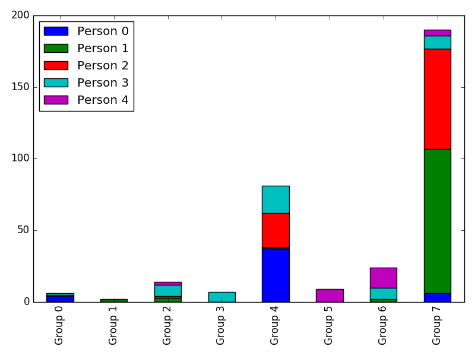

## What is this?

This is a script create a stacked-bar chart summarising email
interactions with internal groups for a number of people.

Note that this was developed for use in a particular context, and it
wil take some work to get it working anywhere apart from the
University of Technology, Sydney.

We are releasing it in case it is useful to anyone else, who might
like to collaborate to make it into more of a general purpose tool.

Here's an example. This is the result of 5 people from our team at UTS
all calling the script to get data about which of the faculties they
have been emailing for single month. This summary data is then
aggregated and anonymised by calling the engagement_stacked.py script,
with the -pg flags to hide their real names.

From this we can see that there is one group which we talk to a *lot*
more than the others, and one staff member in particular who emails
a lot with members of that group.



At the moment we're throwing away data about how we interact with our
own division, and external emails, but we have plans to add some more
config so we can track how we deal with known domains, such as our vendors
and external eResearch organisations.

## Audience

This is an alpha-quality script with *NO TESTS*, for Python
programmers or sys admins only. It *could* be turned into an easy-to-use
web service, but right now it's commandline, and likely to be flaky.

## Prepare

To use this you will need access to an IMAP server for email. If
you're with the Office 365 program, or Google then you're fine. At UTS
we use  outlook.office365.com.

You also need access to an LDAP server which can be used to look-up
email addresses. Turns out that at UTS there is a
[publicly available web page](https://learn.it.uts.edu.au/aip/enrolled/06-jndi/lab-ldap.shtml)
that sets out how to connect to LDAP using the commandline tool
ldapsearch. Using hints found on that page, for how to query the UTS
LDAP server we can work out that the LDAP attribute we're interested
in (which tells us the division the user works for) is utsUnitLevel1.

If you can manage this then go ahead and install it. We have included a sample groups.json file for you to hack away at.

## Install

* Set up a virtual environment for python 3:

     ```mkdir ~/virtualenvs```
     
     ```pyvenv ~/virtualenvs/email-interrogator```
     
	 ```. ~/virtualenvs/email-interrogator```

* Clone the code and install

    ``` git clone  https://github.com/UTS-eResearch/email-interrogator.git```
    
     ```cd email-interrogator```
     
     ```pip3 install  .```


## Run the scripts

*  Before you go on, check that you have:

     * The address of an IMAP server

     * The address of your LDAP server

     * The LDAP property that contains the divisional or group
  information.

*  For each member of the team, run this (change "Sent Items" if
   needed, and adjust the query for the reporting period you're
   interested in (--query)) and replace all the parameters with ones relevant to you. These ones work for me.
   
      ```python engagement_individual.py outlook.office365.com peter.sefton@uts.edu.au -f "Sent Items" -q "SINCE 01-Dec-2016 BEFORE 01-Jan-2017"  -m  groups.json --ldap  ldap.uts.edu.au --unit-string utsUnitLevel1```

     The script will write its output into a directory (under ./Output) named for the
    query (-q) parameter, this case: ```Output/SINCE 01-Dec-2016 BEFORE 01-Jan-2017```

*  When the script has been run for each team member, run this to
   generate a stacked-bar chart:

        ```python engagement_stacked.py Output/SINCE\ 01-Dec-2016\ BEFORE\ 01-Jan-2017/```

	The script will write its output as images into the directory
    passed on the commandline.

    *  To show the images:
	
	    ```python engagement_stacked.py Output/SINCE\ 01-Dec-2016\    BEFORE\ 01-Jan-2017/ --show```
